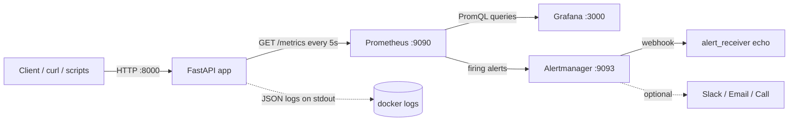
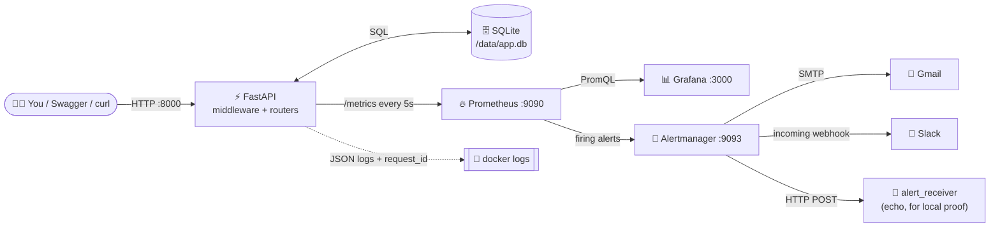
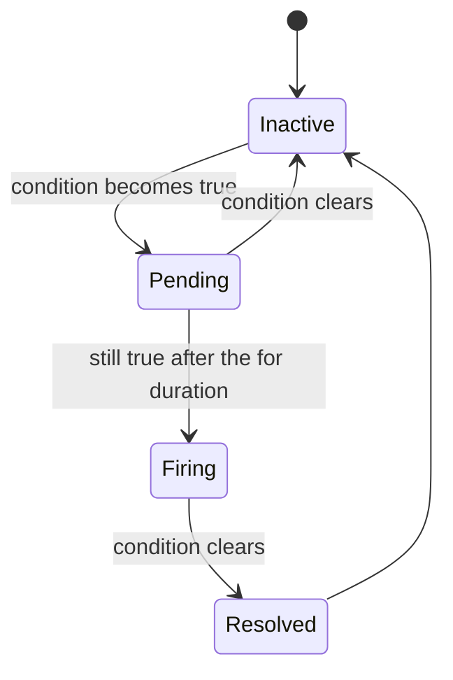

<!-- # API Monitoring Dashboard (FastAPI + Prometheus + Grafana + Alertmanager)

A sample FastAPI service with end-to-end monitoring: Prometheus metrics, a
provisioned Grafana dashboard, Alertmanager notifications, structured JSON
logs with request-ID correlation, deterministic failure simulation endpoints
and an automated test suite.

## Table of contents

1. [Architecture](#architecture)
2. [Quick start](#quick-start)
3. [Endpoint index](#endpoint-index)
4. [Dashboard configuration](#dashboard-configuration)
5. [Alert rules](#alert-rules)
6. [Failure simulation manual](#failure-simulation-manual)
7. [Root-cause analysis guide](#root-cause-analysis-rca-guide)
8. [Enabling Slack and Email](#enabling-slack-and-email)
9. [Testing](#testing)
10. [Maintenance and troubleshooting](#maintenance-and-troubleshooting)

## Architecture



```text
 client ──► FastAPI middleware ──► router ──► response
               │  (X-Request-ID, latency, status)
               ├─► Prometheus metrics: http_requests_total, http_request_duration_seconds,
               │                       http_requests_in_flight, api_up
               └─► structlog JSON line {request_id, method, path, status_code, duration_ms}
```

| Component | Role | Port |
| --- | --- | --- |
| `fastapi_app` | Sample API, exposes `/metrics`, emits JSON logs | 8000 |
| `prometheus` | Scrapes every 5s, evaluates `monitoring/alerts.yml` | 9090 |
| `alertmanager` | Groups and routes alerts | 9093 |
| `alert_receiver` | Echo webhook target; proof of notification delivery | internal |
| `grafana` | Auto-provisioned dashboard `FastAPI API Monitoring` | 3000 |

Metrics emitted by the app (the `/metrics` endpoint itself is not counted):

| Metric | Type | Labels |
| --- | --- | --- |
| `http_requests_total` | counter | `method`, `endpoint`, `status_code` |
| `http_request_duration_seconds` | histogram (0.05, 0.1, 0.5, 1, 3, 5, 10) | `method`, `endpoint` |
| `http_requests_in_flight` | gauge | none |
| `api_up` | gauge (1 healthy, 0 unhealthy) | none |

`endpoint` is the route template (for example `/users`), and unknown paths are
labelled `unmatched`, which keeps label cardinality bounded. Default
`process_*` and `python_*` collectors also expose server health (memory, CPU,
file descriptors).

## Quick start

Requirements: Docker with Compose v2.

```bash
docker-compose up --build -d      # or: docker compose up --build -d
docker compose ps                 # all services should become healthy
```

| URL | Purpose | Credentials |
| --- | --- | --- |
| http://localhost:8000/docs | Swagger UI | none |
| http://localhost:3000 | Grafana (dashboard opens as home) | `admin` / `admin` (override with `GRAFANA_ADMIN_PASSWORD`) |
| http://localhost:9090 | Prometheus (`/targets`, `/alerts`) | none |
| http://localhost:9093 | Alertmanager | none |

Local development without Docker:

```bash
python -m venv .venv && source .venv/bin/activate
pip install -r requirements.txt
uvicorn app.main:app --reload --port 8000
```

Configuration is via environment variables (prefix `APP_`):

| Variable | Default | Meaning |
| --- | --- | --- |
| `APP_LOG_LEVEL` | `INFO` | Log level |
| `APP_TIMEOUT_DELAY_SECONDS` | `3.5` | Delay used by `/simulate-timeout` |
| `APP_RATE_LIMIT_RETRY_AFTER_SECONDS` | `30` | `Retry-After` for `/simulate-rate-limit` |
| `APP_HEALTH_FORCE_FAILURE` | `false` | Makes `/health` return 503 and `api_up=0` |

## Endpoint index

| Method | Path | Result |
| --- | --- | --- |
| GET | `/health` | `200` status `ok`, uptime, dependency health (`503` and `api_up=0` if unhealthy) |
| GET | `/users` | `200` sample users |
| GET | `/products` | `200` sample products |
| GET | `/simulate-auth-error` | `401` `{"error": "Invalid API key or token"}` (Scenario 1) |
| GET | `/simulate-timeout[?seconds=n]` | `200` after 3.5s by default (Scenario 2) |
| GET | `/simulate-error[?mode=http\|unhandled\|random]` | `500` with logged stack trace (Scenario 3) |
| GET | `/simulate-rate-limit` | `429` with `Retry-After` header (Scenario 4) |
| GET | `/metrics` | Prometheus exposition format |

## Dashboard configuration

The dashboard is provisioned from files and needs no manual setup:

- `grafana/provisioning/datasources/prometheus.yml` creates the Prometheus datasource (uid `prometheus`, 5s scrape interval).
- `grafana/provisioning/dashboards/dashboard.yml` loads every JSON in `/etc/grafana/dashboards`.
- `grafana/dashboards/api-monitoring.json` is the dashboard model (auto-refresh 5s, default range 15m).

| Panel | Query summary |
| --- | --- |
| API Service Status | `min(up{job="fastapi"}) * max(api_up)` mapped to UP/DOWN |
| Overall Uptime % | `avg_over_time(up[$__range]) * 100` |
| Average Response Time | histogram `_sum / _count` over the selected range, in ms |
| Total Requests | `increase(http_requests_total[$__range])` |
| Failed Requests (4xx + 5xx) | `increase(...{status_code=~"[45].."}[$__range])` |
| Total Error Rate (%) | failed requests as a share of all requests |
| RPS by HTTP Status Code | `sum by (status_code) (rate(...))` |
| Latency p50 / p90 / p99 | `histogram_quantile` on the duration buckets, 3s threshold line |
| Failed Requests and Error Trends | stacked 4xx/5xx per second |
| 5xx Error Ratio | percentage with the 5% alert threshold |
| Active / In-Flight Requests | `sum(http_requests_in_flight)` |
| Requests per Second by Endpoint | for locating the failing route |

Edits made in the Grafana UI are allowed (`allowUiUpdates: true`). To persist
them, export the JSON and replace `grafana/dashboards/api-monitoring.json`.

## Alert rules

Defined in `monitoring/alerts.yml`. Prometheus evaluates every 5s.

| Alert | Expression (abridged) | For | Severity |
| --- | --- | --- | --- |
| `APIDowntime` | `api_up == 0 or up{job="fastapi"} == 0` | 30s | critical |
| `HighResponseTime` | `histogram_quantile(0.95, sum(rate(http_request_duration_seconds_bucket[2m])) by (le)) > 3.0` | 1m | warning |
| `HTTP500ServerErrors` | 5xx rate / total rate over 2m `> 0.05` | 30s | critical |
| `RateLimitSpike` | `sum(rate(http_requests_total{status_code="429"}[1m])) > 0.1` | 15s | warning |
| `AuthFailureSpike` | `sum(rate(http_requests_total{status_code="401"}[1m])) > 0.2` | 15s | warning |

Alertmanager (`monitoring/alertmanager.yml`) groups by `alertname` and
`severity` (`group_wait: 5s`) and posts to the `alert_receiver` container.
Slack, email and optional phone alerts are documented below.

Note on ratio and quantile alerts: they need sustained traffic. A single
failing request does not move a 2-minute ratio, so the simulations below send
traffic in loops. The Docker healthcheck adds a small baseline of successful
`/health` requests (one every 10s).

## Failure simulation manual

Start from a healthy stack (`docker compose ps`), open the Grafana dashboard
and keep http://localhost:9090/alerts in another tab. Capture the request ID
of a failing call with `-i`:

```bash
curl -i localhost:8000/simulate-error?mode=http | grep -i x-request-id
```

### Scenario 1: invalid API authentication (401)

```bash
curl -i localhost:8000/simulate-auth-error
for i in $(seq 1 45); do curl -s -o /dev/null -w "%{http_code} " localhost:8000/simulate-auth-error; sleep 1; done; echo
```

| Expected | Where to see it |
| --- | --- |
| HTTP 401, body `{"error": "Invalid API key or token"}` | curl output |
| 401 series in "RPS by HTTP Status Code" and "Failed Requests" panels | Grafana |
| Log line `simulated_auth_failure` (`reason: invalid_api_key`) and `http_request` with `status_code: 401` | `docker compose logs fastapi_app` |
| `AuthFailureSpike` pending, then FIRING after about 15s above 0.2 req/s | Prometheus `/alerts`, Alertmanager, `alert_receiver` logs |

### Scenario 2: API timeout / slow response

```bash
# Client-side timeout: curl gives up after 3s (exit code 28)
curl -m 3 -s -o /dev/null -w "%{http_code} %{time_total}s\n" localhost:8000/simulate-timeout; echo "exit=$?"

# Sustained slow traffic for ~3 minutes (about one slow request every 2s)
for i in $(seq 1 90); do curl -s -o /dev/null localhost:8000/simulate-timeout & sleep 2; done; wait
```

| Expected | Where to see it |
| --- | --- |
| Responses take about 3.5s | `curl -w "%{time_total}"` |
| Latency panel p95/p99 above the red 3s line; requests land in the 5s bucket | Grafana |
| Log line `simulated_slow_response` (`delay_seconds: 3.5`) and `http_request` with `duration_ms` above 3500 | JSON logs |
| `HighResponseTime` FIRING after p95 stays above 3s for 1 minute | Prometheus, Alertmanager |

### Scenario 3: server error (500)

```bash
curl -i "localhost:8000/simulate-error?mode=unhandled"   # unhandled RuntimeError
curl -i "localhost:8000/simulate-error?mode=http"        # HTTPException(500)
for i in $(seq 1 60); do curl -s -o /dev/null -w "%{http_code} " "localhost:8000/simulate-error"; sleep 0.5; done; echo
```

| Expected | Where to see it |
| --- | --- |
| HTTP 500, body contains `request_id` for the unhandled mode | curl |
| 5xx ratio panel above the 5% line; failed-requests panel shows 500 | Grafana |
| `unhandled_exception` / `simulated_server_error` log lines with a full stack trace in the `exception` field | JSON logs |
| `HTTP500ServerErrors` FIRING after the ratio exceeds 5% for 30s | Prometheus, Alertmanager |

### Scenario 4: rate limit exceeded (429)

```bash
curl -i localhost:8000/simulate-rate-limit            # shows Retry-After: 30
for i in $(seq 1 60); do curl -s -o /dev/null -w "%{http_code} " localhost:8000/simulate-rate-limit; sleep 0.5; done; echo
```

| Expected | Where to see it |
| --- | --- |
| HTTP 429 with `Retry-After` header | curl |
| 429 bars in the failed-requests panel | Grafana |
| `simulated_rate_limit` log line | JSON logs |
| `RateLimitSpike` FIRING after more than 0.1 req/s for 15s | Prometheus, Alertmanager |

### Scenario 5: downtime and service-health failure

```bash
# Health failure: /health returns 503 and api_up becomes 0
APP_HEALTH_FORCE_FAILURE=true docker compose up -d fastapi_app
curl -i localhost:8000/health
APP_HEALTH_FORCE_FAILURE=false docker compose up -d fastapi_app   # recover

# Hard downtime: Prometheus cannot scrape the target (up == 0)
docker compose stop fastapi_app
docker compose start fastapi_app
```

`APIDowntime` fires about 30s after `api_up` or `up` drops to 0 and resolves
after recovery. The dashboard status tile shows DOWN.

### Verifying notifications

```bash
docker compose logs -f alert_receiver                 # webhook payloads
curl -s localhost:9093/api/v2/alerts | jq '.[].labels.alertname'
curl -s localhost:9090/api/v1/alerts | jq '.data.alerts[] | {alert: .labels.alertname, state}'
```

## Root-cause analysis (RCA) guide

Every request gets an `X-Request-ID` (an incoming header is honoured,
otherwise one is generated). The ID is returned to the caller, bound to every
log line produced while serving the request, and included in the body of 500
responses from unhandled exceptions. That is the link between a metric spike
and the exact failing request.

1. **Start from the alert or panel.** Note the time and the alert name, for example `HTTP500ServerErrors` at 14:32.
2. **Find the failing endpoint** in Prometheus or the "Requests per Second by Endpoint" panel:
```promql
   topk(5, sum by (endpoint, status_code) (rate(http_requests_total{status_code=~"[45].."}[5m])))
```
   For latency, find the slow route:
```promql
   topk(5, histogram_quantile(0.95, sum by (le, endpoint) (rate(http_request_duration_seconds_bucket[5m]))))
```
3. **Pull the matching logs** for that window:
```bash
   docker compose logs --no-log-prefix --since 15m fastapi_app | jq -c 'select(.level=="error")'
```
4. **Read the stack trace.** Error logs carry `exception` with the traceback. For the simulation, `RuntimeError: Simulated unhandled failure: database connection pool exhausted` points to the failing component.
5. **Trace one request end to end** using its ID:
```bash
   docker compose logs --no-log-prefix fastapi_app | jq -c 'select(.request_id=="<ID>")'
```
6. **Classify the failure:**

   | Signal | Likely cause | Next step |
   | --- | --- | --- |
   | 401 spike on one endpoint | Expired/invalid credentials or a misconfigured client | Check the client's key rotation; look for a single source in the `client` log field |
   | p95 above 3s on one endpoint, in-flight requests rising | Slow upstream or exhausted workers | Check dependency health in `/health`, resource usage in `process_*` metrics |
   | 5xx with traceback | Unhandled application or dependency error | Fix the code path in the traceback; correlate with deploy time |
   | 429 bursts | Client over quota or retry storm | Check client backoff honours `Retry-After` |
   | `up == 0` with `api_up` absent | Container crashed or network issue | `docker compose ps`, `docker compose logs fastapi_app` |
   | `api_up == 0` while scrape works | Dependency failing in `/health` | Read the `dependencies` object in the `/health` response |

7. **Document the outcome:** alert, impact window, root cause, fix, and a follow-up (new test, tuned threshold).

Example log line for a failed request:

```json
{"event": "http_request", "method": "GET", "path": "/simulate-error", "endpoint": "/simulate-error",
 "status_code": 500, "duration_ms": 3.41, "client": "172.18.0.1", "request_id": "9f1c2b7e4a8d4c1f9a0b5d3e7c6a1b22",
 "level": "error", "logger": "app.access", "timestamp": "2026-01-15T14:32:07.512345Z"}
```

## Enabling Slack and Email

Alertmanager does not expand environment variables, so store secrets in files.

1. Create the secrets (git-ignored):
```bash
   mkdir -p secrets
   printf '%s' 'https://hooks.slack.com/services/XXX/YYY/ZZZ' > secrets/slack_webhook_url
   printf '%s' 'smtp-password' > secrets/smtp_password
```
2. Mount them in the `alertmanager` service in `docker-compose.yml`:
```yaml
   volumes:
     - ./secrets:/etc/alertmanager/secrets:ro
```
3. Uncomment the `slack-critical` and/or `email-oncall` receivers in `monitoring/alertmanager.yml`, then route to them. For example, to send critical alerts to Slack and email while keeping the webhook:
```yaml
   route:
     receiver: local-webhook
     routes:
       - matchers: ['severity="critical"']
         receiver: slack-critical
         continue: true
       - matchers: ['severity="critical"']
         receiver: email-oncall
```
4. Validate and reload:
```bash
   docker compose exec alertmanager amtool check-config /etc/alertmanager/alertmanager.yml
   docker compose restart alertmanager
```

Phone/call alerts (optional): add a `webhook_configs` or `pagerduty_configs`
receiver for a paging provider (PagerDuty, Opsgenie, or a Twilio webhook
bridge) and route `severity="critical"` to it.

## Testing

```bash
pip install -r requirements.txt
pytest -q
```

The suite uses `httpx.AsyncClient` against the ASGI app and covers: `/health`
(including forced failure and `api_up`), request-ID handling, `/metrics`,
`/users`, `/products`, and the 401, 500 (both modes), 429 and delay behaviour,
plus counter increments and the in-flight gauge. One test waits the full 3.5s
default delay.

## Maintenance and troubleshooting

### Routine maintenance

| Task | Command |
| --- | --- |
| Check service status | `docker compose ps` |
| Tail application logs | `docker compose logs -f --no-log-prefix fastapi_app \| jq` |
| Validate Prometheus config and rules | `docker compose exec prometheus promtool check config /etc/prometheus/prometheus.yml` |
| Reload Prometheus after rule edits | `curl -X POST localhost:9090/-/reload` |
| Reload Alertmanager config | `docker compose restart alertmanager` |
| Back up dashboards | Export JSON from Grafana into `grafana/dashboards/` |
| Update images | Bump the pinned tags in `docker-compose.yml`, then `docker compose pull && docker compose up -d` |
| Reset all data | `docker compose down -v` (deletes Prometheus, Grafana and Alertmanager volumes) |

Prometheus retention is 7 days (`--storage.tsdb.retention.time`). Review alert
thresholds after any change in traffic patterns.

### Troubleshooting

| Symptom | Check / fix |
| --- | --- |
| Dashboard shows "No data" | Prometheus `/targets`: `fastapi` must be UP. Verify `curl localhost:8000/metrics`. Confirm the datasource uid is `prometheus` |
| Target is DOWN | `docker compose logs fastapi_app`; confirm the container is healthy and on `monitoring_network` |
| Alert stays Pending | Wait for the `for:` duration. Ratio and quantile alerts need continuous traffic; rerun the loop |
| Alert FIRING but no notification | `curl localhost:9093/api/v2/status`; check Alertmanager logs; for Slack verify the secret file path and webhook URL |
| Latency alert never fires | Confirm slow requests are being sent for over 1 minute (`rate()` over 2m needs samples in the window) |
| `docker compose up` waits on a service | Run `docker compose ps`; `prometheus` waits for `fastapi_app` and `alertmanager` to be healthy |
| `/health` returns 503 | Read the `dependencies` field; unset `APP_HEALTH_FORCE_FAILURE` if it was set for a simulation |
| Grafana login rejected | Credentials are `admin` / `$GRAFANA_ADMIN_PASSWORD`; the password in a persisted volume only changes with `docker compose down -v` or via the Grafana UI |

## Project layout

```text
app/          FastAPI app: config, logging, metrics, routers (health, users, products, simulation)
monitoring/   prometheus.yml, alerts.yml, alertmanager.yml
grafana/      provisioning (datasource, dashboard provider) and dashboards/api-monitoring.json
tests/        pytest + httpx suites
screenshots/  evidence checklist
``` -->

<div align="center">

# 🩺 Pulse: API Monitoring Dashboard

### An API that tells *me* when it's sick, before anyone else has to.

A small FastAPI service that can **break on purpose**, wrapped in the monitoring I'd want on a real one:
metrics, a live dashboard, alerts to **email + Slack + webhook**, and logs I can trace back to a single request.


[Why](#-why-i-built-this) · [Quick start](#-quick-start) · [Notifications](#-notifications-email-slack-webhook) · [Break it](#-break-it-on-purpose) · [Find the cause](#-finding-the-root-cause) · [Troubleshooting](#-troubleshooting)

</div>

---

## 💡 Why I built this

An API usually "works" right up until it quietly doesn't: a few slow responses, a burst of `401`s, a database table that went missing. Most of the time I'd only find out when somebody told me.

I wanted the opposite: the API tells me first, and tells me *why*.

So I built a tiny service with the endpoints you'd expect (`/health`, `/users`, `/products`) plus a handful of endpoints whose only job is to fail in realistic ways: a `500`, a slow response, a `429`, a `401`. Then I put the full observability loop around it:

| 👀 See it | 🔔 Hear about it | 🔎 Explain it |
|---|---|---|
| Prometheus collects metrics every 5 s. Grafana turns them into a live dashboard. | Alertmanager sends a message to **Gmail, Slack and a webhook** when something stays broken. | Every request gets an ID that is returned to the caller and stamped on every log line. |

The whole thing starts with one command, runs in five containers, and needs nothing else installed but Docker.

---

## 🗺️ How it fits together



**Life of an alert**



Alertmanager notifies on **Firing** and again on **Resolved**, so the all-clear arrives too.

| Container | Port | What it does |
|---|---|---|
| `fastapi_app` | 8000 | The API, `/metrics`, Swagger docs, SQLite file in a Docker volume |
| `prometheus` | 9090 | Scrapes every 5 s, evaluates 5 alert rules, keeps 7 days of data |
| `alertmanager` | 9093 | Groups alerts and routes them to email, Slack and the webhook |
| `alert_receiver` | internal | Echo container that prints every webhook, so delivery is visible in logs |
| `grafana` | 3000 | Pre-provisioned 12-panel dashboard, no clicking required |

---

## 🚀 Quick start

**You need:** Docker Desktop (WSL 2 on Windows) and free ports `8000`, `9090`, `9093`, `3000`.

```powershell
git clone https://github.com/Nieldave/api-monitoring-dashboard.git
cd api-monitoring-dashboard

# Alertmanager mounts ./secrets, so create it (see "Notifications" to fill it in)
New-Item -ItemType Directory -Force secrets | Out-Null

docker compose up -d --build
docker compose ps
```

After a minute, `docker compose ps` should list all five containers, with the first four marked **healthy**.

> 💡 **Without the secret files** the stack still runs and the webhook still works. Email and Slack just log an error until you add credentials (next section).

### 🔗 Where to look

| What | URL | Login |
|---|---|---|
| 📘 Swagger (try every endpoint) | http://localhost:8000/docs | none |
| 📊 Grafana dashboard | http://localhost:3000 | `admin` / `admin` (skip the password prompt) |
| 🔥 Prometheus alerts | http://localhost:9090/alerts | none |
| 🎯 Prometheus targets | http://localhost:9090/targets | none |
| 🚨 Alertmanager | http://localhost:9093 | none |
| 📈 Raw metrics | http://localhost:8000/metrics | none |

Open Swagger, click **Try it out → Execute** on `/health`, `/users` and `/products`, then watch the Grafana numbers move.

<details>
<summary>▶️ Run only the API, without Docker</summary>

```powershell
python -m venv .venv
.\.venv\Scripts\Activate.ps1      # if blocked: Set-ExecutionPolicy -Scope Process Bypass
pip install -r requirements.txt
uvicorn app.main:app --port 8000
```

macOS / Linux: `source .venv/bin/activate`. The dashboard and alerts need the Docker stack.

</details>

<details>
<summary>🧹 Stop and clean up</summary>

```powershell
docker compose down        # stop containers, keep data
docker compose down -v     # stop and delete everything (Prometheus, Grafana, SQLite)
```

</details>

---

## 🔌 The API

Every endpoint is a `GET`, so Swagger and a browser are all you need.

| Endpoint | Returns | Purpose |
|---|---|---|
| `/health` | `200` / `503` | Status, uptime, dependency checks (including a real SQLite query). Sets `api_up` |
| `/users` | `200` / `500` | Rows from the SQLite `users` table |
| `/products` | `200` / `500` | Rows from the SQLite `products` table |
| `/simulate-auth-error` | `401` | Invalid API key or token |
| `/simulate-timeout` | `200` (slow) | Sleeps 3.5 s. `?seconds=` overrides the delay |
| `/simulate-error` | `500` | `?mode=http`, `?mode=unhandled` (full stack trace) or `random` |
| `/simulate-rate-limit` | `429` | Includes a `Retry-After: 30` header |
| `/metrics` | `200` | Prometheus metrics (not counted in request metrics) |

### 🗄️ Real data, not hard-coded lists

Users and products live in SQLite (`app/database.py`). Tables are created on startup, seeded with 5 rows each, and stored in the `app_data` Docker volume, so data survives restarts.

```powershell
# Look inside the database
docker compose exec fastapi_app python -c "import sqlite3; c=sqlite3.connect('/data/app.db'); print(c.execute('SELECT * FROM users').fetchall())"

# Change a row, then call GET /users again: the API reflects it with no restart
docker compose exec fastapi_app python -c "import sqlite3; c=sqlite3.connect('/data/app.db'); c.execute('UPDATE users SET name=? WHERE id=1',('Demo Live Edit',)); c.commit()"
```

---

## 📡 What gets measured

| Metric | Type | Why it matters |
|---|---|---|
| `http_requests_total{method,endpoint,status_code}` | counter | Traffic, failures, error percentage, per-status rates |
| `http_request_duration_seconds` | histogram (0.05 → 10 s) | Average and p50 / p90 / p95 / p99 latency |
| `http_requests_in_flight` | gauge | Concurrency and pile-ups |
| `api_up` | gauge | `1` when `/health` passes, `0` when a dependency fails |
| `up{job="fastapi"}` | built-in | Can Prometheus reach the API at all? |
| `process_*`, `python_*` | default collectors | Memory, CPU, file descriptors (server health) |

The `endpoint` label is the **route template**, and unknown paths become `unmatched`, so label cardinality stays bounded.

---

## 📊 The dashboard

Grafana loads the datasource and the **FastAPI API Monitoring** dashboard automatically (`grafana/`). It opens as the home page and refreshes every 5 s. Set the range to **Last 15 minutes**.

| Row | Panels |
|---|---|
| 🟢 At a glance | Service status (UP/DOWN) · Uptime % · Average response time · Total requests · Failed requests (4xx + 5xx) · Error rate % |
| 📈 Trends | Throughput by status code · Latency p50/p90/p99 (with the 3 s line) · Failed requests and error trends · 5xx ratio vs the 5 % threshold · In-flight requests · Requests per endpoint |

The **Requests per endpoint** panel is the quickest way to see *which* route is misbehaving.

---

## 🚨 Alerts

Five rules in `monitoring/alerts.yml`, evaluated every 5 s:

| Alert | Fires when | For | Severity |
|---|---|---|---|
| `APIDowntime` | `api_up == 0` or the scrape target is down | 30 s | 🔴 critical |
| `HighResponseTime` | p95 latency over 2 min is above **3 s** | 1 m | 🟠 warning |
| `HTTP500ServerErrors` | 5xx responses exceed **5 %** of requests (2 min window) | 30 s | 🔴 critical |
| `RateLimitSpike` | `429` responses above **0.1 / s** | 15 s | 🟠 warning |
| `AuthFailureSpike` | `401` responses above **0.2 / s** | 15 s | 🟠 warning |

Alerts are grouped by `alertname` and `severity`, so a burst becomes one message instead of fifty. The first message goes out after 5 s, updates follow every 30 s, and repeats every hour.

> ℹ️ Rate and quantile alerts need *sustained* traffic. One bad request won't move a 2-minute ratio, so the scenarios below run in loops.

---

## 📬 Notifications: email, Slack, webhook

All three channels hang off one Alertmanager receiver (`monitoring/alertmanager.yml`), and every firing or resolved alert is delivered to each of them independently. If Gmail is down, Slack and the webhook still work.

Secrets never go into the YAML. They are read from files in `./secrets/` (git-ignored, mounted read-only into the container).

### 🧪 Webhook (works out of the box)

```powershell
docker compose logs alert_receiver --tail 60
```

### 📧 Email via Gmail

1. Turn on 2-Step Verification for the Gmail account, then create an **App Password** (your normal password will not work).
2. Save it:
   ```powershell
   Set-Content -Path .\secrets\smtp_password -Value "your-16-char-app-password" -NoNewline -Encoding ascii
   ```
3. In `monitoring/alertmanager.yml`, set your address in `smtp_from`, `smtp_auth_username` and `email_configs → to / from`.

### 💬 Slack

1. Create an app with **Incoming Webhooks** and add a webhook for a channel (for example `#api-alerts`).
2. Save the URL (no quotes, no extra text):
   ```powershell
   Set-Content -Path .\secrets\slack_webhook_url -Value "https://hooks.slack.com/services/XXXXX/XXXXX/XXXXXXXX" -NoNewline -Encoding ascii
   ```
3. Test the webhook on its own:
   ```powershell
   Invoke-RestMethod -Uri (Get-Content .\secrets\slack_webhook_url -Raw) -Method Post -ContentType "application/json" -Body '{"text":"Hello from the terminal"}'
   ```

### ✅ Apply and test the whole pipeline

```powershell
docker compose exec alertmanager amtool check-config /etc/alertmanager/alertmanager.yml
docker compose restart alertmanager

# Send a fake alert straight to Alertmanager
$body = '[{"labels":{"alertname":"SlackTest","severity":"warning","service":"fastapi-monitoring-demo"},"annotations":{"summary":"Test alert","description":"Manual test alert"}}]'
Invoke-RestMethod -Uri http://localhost:9093/api/v2/alerts -Method Post -ContentType "application/json" -Body $body
```

Within ~10 s a `[FIRING] SlackTest` message should land in Slack and in your inbox, followed by `[RESOLVED]` about a minute later.

> 🔒 Never commit the files in `secrets/`. If a webhook URL or App Password ever leaks, revoke it and create a new one.

---

## 💥 Break it on purpose

This is the fun part. Keep Grafana, `http://localhost:9090/alerts` and Slack open side by side, then pick a scenario. Use `curl.exe` in PowerShell (plain `curl` is an alias for `Invoke-WebRequest`).

| # | Scenario | Endpoint | Alert you should see | Roughly |
|---|---|---|---|---|
| 1 | 🔑 Invalid authentication | `/simulate-auth-error` | `AuthFailureSpike` | 15 to 30 s |
| 2 | 🐢 Slow response | `/simulate-timeout` | `HighResponseTime` | 1 to 2 min |
| 3 | 💣 Server error | `/simulate-error` | `HTTP500ServerErrors` | 30 to 45 s |
| 4 | 🚦 Rate limit | `/simulate-rate-limit` | `RateLimitSpike` | 15 to 30 s |
| 5 | 🔌 Downtime / failed health | stop the container | `APIDowntime` | ~30 s |
| 6 | 🗄️ Database failure | drop a table | `HTTP500ServerErrors` + `APIDowntime` | 30 to 45 s |

<details>
<summary><b>🔑 1. Invalid authentication (401)</b></summary>

```powershell
curl.exe -i http://localhost:8000/simulate-auth-error
1..60 | % { curl.exe -s -o NUL -w "%{http_code} " http://localhost:8000/simulate-auth-error; Start-Sleep 1 }
```

You'll see 401 bars in Grafana and the log line `simulated_auth_failure` with `reason: invalid_api_key`.

</details>

<details>
<summary><b>🐢 2. Slow response / timeout</b></summary>

```powershell
curl.exe -m 3 http://localhost:8000/simulate-timeout        # client gives up: curl error 28
1..60 | % { curl.exe -s -o NUL -w "%{time_total}s " http://localhost:8000/simulate-timeout }
```

p95 and p99 cross the red 3 s line. Logs show `duration_ms` above 3500.

</details>

<details>
<summary><b>💣 3. Server error (500)</b></summary>

```powershell
curl.exe -i "http://localhost:8000/simulate-error?mode=unhandled"
1..80 | % { curl.exe -s -o NUL -w "%{http_code} " http://localhost:8000/simulate-error; Start-Sleep -Milliseconds 500 }
```

The 5xx ratio climbs above the 5 % line. The `unhandled` mode leaves a full stack trace in the logs.

</details>

<details>
<summary><b>🚦 4. Rate limit (429)</b></summary>

```powershell
curl.exe -i http://localhost:8000/simulate-rate-limit        # note the Retry-After header
1..60 | % { curl.exe -s -o NUL -w "%{http_code} " http://localhost:8000/simulate-rate-limit; Start-Sleep -Milliseconds 500 }
```

</details>

<details>
<summary><b>🔌 5. Downtime and failed health check</b></summary>

```powershell
# Hard down: Prometheus can't scrape
docker compose stop fastapi_app
docker compose start fastapi_app

# Soft down: the API is up but reports itself unhealthy (/health returns 503, api_up = 0)
$env:APP_HEALTH_FORCE_FAILURE = "true"; docker compose up -d fastapi_app
Remove-Item Env:APP_HEALTH_FORCE_FAILURE; docker compose up -d fastapi_app
```

The status tile turns **DOWN**. When the service returns, you get a `[RESOLVED]` message.

</details>

<details>
<summary><b>🗄️ 6. Database failure (run this last)</b></summary>

```powershell
docker compose exec fastapi_app python -c "import sqlite3; c=sqlite3.connect('/data/app.db'); c.execute('DROP TABLE users'); c.commit()"
1..80 | % { curl.exe -s -o NUL -w "%{http_code} " http://localhost:8000/users; Start-Sleep -Milliseconds 500 }
```

`/users` returns 500, `/health` returns 503 with `database: unavailable`, and the log contains `sqlite3.OperationalError: no such table: users`.
Recover with `docker compose restart fastapi_app`, which recreates and reseeds the table.

</details>

> ⏱️ Wait about 3 minutes between scenarios (or run `docker compose restart fastapi_app`) so the previous alert's rate window can clear.

---

## 🔎 Finding the root cause

An alert tells you *that* something is wrong. Request IDs tell you *why*. Every request gets an `X-Request-ID` header (an incoming one is honoured), and the same ID appears on every JSON log line written while that request ran.

**The routine:**

1. **Symptom.** Start from the alert or the Grafana panel.
2. **Where.** The *Requests per endpoint* panel names the failing route.
3. **What.** Pull the error log and stack trace:
   ```powershell
   docker compose logs fastapi_app --no-log-prefix --since 15m | Select-String "unhandled_exception" | ForEach-Object { $_.Line | ConvertFrom-Json } | Select-Object -First 1 | Format-List event, request_id, exception
   ```
4. **Which request.** Follow one request end to end:
   ```powershell
   docker compose logs fastapi_app --no-log-prefix | Select-String "PASTE_REQUEST_ID_HERE"
   ```
5. **Database suspects:**
   ```powershell
   docker compose logs fastapi_app --no-log-prefix --since 5m | Select-String "no such table" | Select-Object -First 1
   ```

**A typical log line**

```json
{"event": "http_request", "method": "GET", "path": "/simulate-error", "endpoint": "/simulate-error",
 "status_code": 500, "duration_ms": 3.41, "client": "172.18.0.1",
 "request_id": "9f1c2b7e4a8d4c1f9a0b5d3e7c6a1b22", "level": "error", "logger": "app.access"}
```

**Reading the signals**

| You see | Likely cause | Next step |
|---|---|---|
| 401 spike on one endpoint | Expired or wrong credentials, or a brute-force attempt | Check the client's key; look at the `client` log field |
| p95 high, in-flight requests rising | Slow dependency or exhausted workers | Check `/health` dependencies and `process_*` metrics |
| 5xx with a traceback | Unhandled error in the code path | Read the traceback; correlate with the last change |
| 429 bursts | Client over quota or a retry storm | Make sure clients honour `Retry-After` |
| `up == 0`, no `api_up` | Container crashed or network problem | `docker compose ps`, then the logs |
| `api_up == 0` but scrapes work | A dependency inside `/health` is failing | Read the `dependencies` object in the response |

---

## 🧪 Tests

20 pytest tests cover health (including forced failure and database-unavailable), reading from SQLite, the 401 / 500 / 429 / delay behaviours, metric counters and request-ID handling. They use a temporary SQLite file, so your Docker data is never touched.

```powershell
python -m venv .venv
.\.venv\Scripts\Activate.ps1
pip install -r requirements.txt
pytest -q
```

It takes about 5 seconds, mostly one test that waits out the full 3.5 s delay.

---

## ⚙️ Configuration

Set with environment variables (prefix `APP_`):

| Variable | Default | Effect |
|---|---|---|
| `APP_LOG_LEVEL` | `INFO` | Log verbosity |
| `APP_TIMEOUT_DELAY_SECONDS` | `3.5` | Delay used by `/simulate-timeout` |
| `APP_RATE_LIMIT_RETRY_AFTER_SECONDS` | `30` | `Retry-After` value on `/simulate-rate-limit` |
| `APP_HEALTH_FORCE_FAILURE` | `false` | Makes `/health` return 503 and sets `api_up = 0` |
| `APP_DATABASE_PATH` | `data/app.db` (`/data/app.db` in Docker) | SQLite file location |
| `GRAFANA_ADMIN_PASSWORD` | `admin` | Grafana admin password |

---

## 🗂️ Project layout

```text
api-monitoring-dashboard/
├── app/
│   ├── main.py              # app factory + request middleware (request IDs, metrics, logs)
│   ├── config.py            # settings from APP_* environment variables
│   ├── database.py          # SQLite schema, seed data, connection helper
│   ├── metrics.py           # Prometheus counter, histogram, gauges
│   ├── logging_config.py    # structured JSON logging (structlog)
│   └── routers/             # health, users, products, simulation
├── monitoring/
│   ├── prometheus.yml       # scrape config (every 5 s) + alerting target
│   ├── alerts.yml           # the 5 alert rules
│   └── alertmanager.yml     # routing + email / Slack / webhook receivers
├── grafana/
│   ├── provisioning/        # datasource + dashboard loader
│   └── dashboards/          # api-monitoring.json
├── tests/                   # pytest suite
├── secrets/                 # smtp_password, slack_webhook_url (git-ignored)
├── screenshots/             # evidence from my own test runs
├── Dockerfile               # multi-stage build, non-root user
├── docker-compose.yml       # the 5-container stack
└── requirements.txt
```

---

## 🧠 Design choices worth knowing

- **Alert on ratios and percentiles, not single events.** A `for:` delay on every rule keeps one blip from paging anyone.
- **Route templates as labels.** `/users`, not `/users?x=1`, so Prometheus never drowns in label combinations.
- **Secrets live in files.** Alertmanager can't expand environment variables, and files keep credentials out of YAML and Git.
- **`/health` checks something real.** It runs actual queries against SQLite, so a broken database shows up as `503` and `api_up = 0`.
- **Independent channels.** Email, Slack and the webhook each succeed or fail on their own.
- **Single uvicorn worker.** `prometheus_client`'s default registry is per process. Multiple workers would need multiprocess mode.

---

## 🛠️ Troubleshooting

<details>
<summary><b>Dashboard shows "No data"</b></summary>

Send some requests, check http://localhost:9090/targets shows `fastapi` as **UP**, and set the time range to *Last 15 minutes*.

</details>

<details>
<summary><b>An alert doesn't fire</b></summary>

Keep the loop running. Rate and quantile alerts need sustained traffic and must stay true for their `for:` time. Check the state at http://localhost:9090/alerts.

</details>

<details>
<summary><b>Alert fires but no email arrives</b></summary>

Check the spam folder, then `docker compose logs alertmanager` for SMTP errors. Make sure `secrets/smtp_password` contains the Gmail **App Password** (not the account password) with no trailing newline.

</details>

<details>
<summary><b>Alert fires but nothing in Slack</b></summary>

Run the direct `Invoke-RestMethod` webhook test above. If it fails, the URL is wrong. If it works, check `docker compose logs alertmanager` and confirm `secrets/slack_webhook_url` has only the URL. If Slack complains about the channel, remove the `channel:` line from the config.

</details>

<details>
<summary><b>Docker Desktop won't start, or <code>docker compose</code> returns a 500</b></summary>

Quit Docker Desktop, run `wsl --update` and `wsl --shutdown` in an admin PowerShell, start Docker Desktop again, and wait for "Engine running".

</details>

<details>
<summary><b>Port already in use</b></summary>

Stop the other program, or change the left-hand port in `docker-compose.yml`.

</details>

<details>
<summary><b><code>/users</code> returns 500 or <code>/health</code> says <code>database: unavailable</code></b></summary>

Search the logs for the `sqlite3` error. `docker compose restart fastapi_app` recreates and reseeds missing tables. If the file is damaged: `docker compose down -v`, then `docker compose up -d`.

</details>

<details>
<summary><b>PowerShell prints errors for <code>curl</code></b></summary>

`curl` is an alias for `Invoke-WebRequest`. Use `curl.exe`.

</details>

---

## 🔧 Day-to-day maintenance

| Task | How |
|---|---|
| Tweak alert thresholds | Edit `monitoring/alerts.yml`, then `docker compose exec prometheus promtool check rules /etc/prometheus/alerts.yml` and `curl.exe -X POST http://localhost:9090/-/reload` |
| Change alert routing | Edit `monitoring/alertmanager.yml`, validate with `amtool check-config`, then `docker compose restart alertmanager` |
| Monitor a new endpoint | Add a route under `app/routers/`. The middleware measures it automatically |
| Back up the database | `docker compose cp fastapi_app:/data/app.db .\backup.db` |
| Reset to seed data | `docker compose down -v` then `docker compose up -d` |
| Upgrade a component | Bump the pinned image tag in `docker-compose.yml`, `docker compose pull && docker compose up -d`, then re-run the tests |

---

## 📸 Screenshots

<details>
<summary>Show the dashboard and alerts in action</summary>

| | |
|---|---|
|  |  |
| Healthy dashboard | Latency crossing the 3 s line |
|  |  |
| Alerts firing in Prometheus | Notification delivered |
|  |  |
| The same alert in Slack | …and in the inbox |

</details>

---

## 🧭 What's next

- [ ] Swap SQLite for PostgreSQL and monitor it with a Postgres exporter
- [ ] Ship logs to Loki so Grafana can jump from a metric spike straight to its log lines
- [ ] Add a Blackbox exporter for external, outside-in uptime checks
- [ ] Inhibit rules, so `APIDowntime` silences the secondary alerts while the service is down
- [ ] A phone or on-call channel (PagerDuty / Opsgenie) for critical alerts

---

<div align="center">

Built by **[Niel](https://github.com/Nieldave)**, because I'd rather hear it from my dashboard than from a user. 🩺

</div>