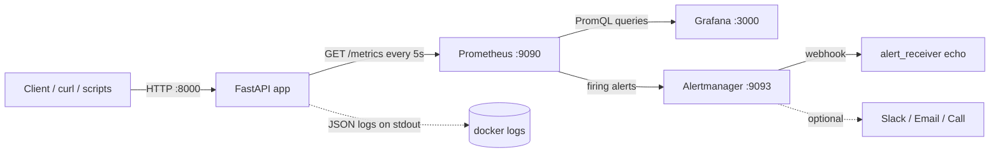

# API Monitoring Dashboard (FastAPI + Prometheus + Grafana + Alertmanager)

A sample FastAPI service with end-to-end monitoring: Prometheus metrics, a
provisioned Grafana dashboard, Alertmanager notifications, structured JSON
logs with request-ID correlation, deterministic failure simulation endpoints
and an automated test suite.

## Table of contents

1. [Architecture](#architecture)
2. [Quick start](#quick-start)
3. [Endpoint index](#endpoint-index)
4. [Dashboard configuration](#dashboard-configuration)
5. [Alert rules](#alert-rules)
6. [Failure simulation manual](#failure-simulation-manual)
7. [Root-cause analysis guide](#root-cause-analysis-rca-guide)
8. [Enabling Slack and Email](#enabling-slack-and-email)
9. [Testing](#testing)
10. [Maintenance and troubleshooting](#maintenance-and-troubleshooting)

## Architecture



```text
 client ──► FastAPI middleware ──► router ──► response
               │  (X-Request-ID, latency, status)
               ├─► Prometheus metrics: http_requests_total, http_request_duration_seconds,
               │                       http_requests_in_flight, api_up
               └─► structlog JSON line {request_id, method, path, status_code, duration_ms}
```

| Component | Role | Port |
| --- | --- | --- |
| `fastapi_app` | Sample API, exposes `/metrics`, emits JSON logs | 8000 |
| `prometheus` | Scrapes every 5s, evaluates `monitoring/alerts.yml` | 9090 |
| `alertmanager` | Groups and routes alerts | 9093 |
| `alert_receiver` | Echo webhook target; proof of notification delivery | internal |
| `grafana` | Auto-provisioned dashboard `FastAPI API Monitoring` | 3000 |

Metrics emitted by the app (the `/metrics` endpoint itself is not counted):

| Metric | Type | Labels |
| --- | --- | --- |
| `http_requests_total` | counter | `method`, `endpoint`, `status_code` |
| `http_request_duration_seconds` | histogram (0.05, 0.1, 0.5, 1, 3, 5, 10) | `method`, `endpoint` |
| `http_requests_in_flight` | gauge | none |
| `api_up` | gauge (1 healthy, 0 unhealthy) | none |

`endpoint` is the route template (for example `/users`), and unknown paths are
labelled `unmatched`, which keeps label cardinality bounded. Default
`process_*` and `python_*` collectors also expose server health (memory, CPU,
file descriptors).

## Quick start

Requirements: Docker with Compose v2.

```bash
docker-compose up --build -d      # or: docker compose up --build -d
docker compose ps                 # all services should become healthy
```

| URL | Purpose | Credentials |
| --- | --- | --- |
| http://localhost:8000/docs | Swagger UI | none |
| http://localhost:3000 | Grafana (dashboard opens as home) | `admin` / `admin` (override with `GRAFANA_ADMIN_PASSWORD`) |
| http://localhost:9090 | Prometheus (`/targets`, `/alerts`) | none |
| http://localhost:9093 | Alertmanager | none |

Local development without Docker:

```bash
python -m venv .venv && source .venv/bin/activate
pip install -r requirements.txt
uvicorn app.main:app --reload --port 8000
```

Configuration is via environment variables (prefix `APP_`):

| Variable | Default | Meaning |
| --- | --- | --- |
| `APP_LOG_LEVEL` | `INFO` | Log level |
| `APP_TIMEOUT_DELAY_SECONDS` | `3.5` | Delay used by `/simulate-timeout` |
| `APP_RATE_LIMIT_RETRY_AFTER_SECONDS` | `30` | `Retry-After` for `/simulate-rate-limit` |
| `APP_HEALTH_FORCE_FAILURE` | `false` | Makes `/health` return 503 and `api_up=0` |

## Endpoint index

| Method | Path | Result |
| --- | --- | --- |
| GET | `/health` | `200` status `ok`, uptime, dependency health (`503` and `api_up=0` if unhealthy) |
| GET | `/users` | `200` sample users |
| GET | `/products` | `200` sample products |
| GET | `/simulate-auth-error` | `401` `{"error": "Invalid API key or token"}` (Scenario 1) |
| GET | `/simulate-timeout[?seconds=n]` | `200` after 3.5s by default (Scenario 2) |
| GET | `/simulate-error[?mode=http\|unhandled\|random]` | `500` with logged stack trace (Scenario 3) |
| GET | `/simulate-rate-limit` | `429` with `Retry-After` header (Scenario 4) |
| GET | `/metrics` | Prometheus exposition format |

## Dashboard configuration

The dashboard is provisioned from files and needs no manual setup:

- `grafana/provisioning/datasources/prometheus.yml` creates the Prometheus datasource (uid `prometheus`, 5s scrape interval).
- `grafana/provisioning/dashboards/dashboard.yml` loads every JSON in `/etc/grafana/dashboards`.
- `grafana/dashboards/api-monitoring.json` is the dashboard model (auto-refresh 5s, default range 15m).

| Panel | Query summary |
| --- | --- |
| API Service Status | `min(up{job="fastapi"}) * max(api_up)` mapped to UP/DOWN |
| Overall Uptime % | `avg_over_time(up[$__range]) * 100` |
| Average Response Time | histogram `_sum / _count` over the selected range, in ms |
| Total Requests | `increase(http_requests_total[$__range])` |
| Failed Requests (4xx + 5xx) | `increase(...{status_code=~"[45].."}[$__range])` |
| Total Error Rate (%) | failed requests as a share of all requests |
| RPS by HTTP Status Code | `sum by (status_code) (rate(...))` |
| Latency p50 / p90 / p99 | `histogram_quantile` on the duration buckets, 3s threshold line |
| Failed Requests and Error Trends | stacked 4xx/5xx per second |
| 5xx Error Ratio | percentage with the 5% alert threshold |
| Active / In-Flight Requests | `sum(http_requests_in_flight)` |
| Requests per Second by Endpoint | for locating the failing route |

Edits made in the Grafana UI are allowed (`allowUiUpdates: true`). To persist
them, export the JSON and replace `grafana/dashboards/api-monitoring.json`.

## Alert rules

Defined in `monitoring/alerts.yml`. Prometheus evaluates every 5s.

| Alert | Expression (abridged) | For | Severity |
| --- | --- | --- | --- |
| `APIDowntime` | `api_up == 0 or up{job="fastapi"} == 0` | 30s | critical |
| `HighResponseTime` | `histogram_quantile(0.95, sum(rate(http_request_duration_seconds_bucket[2m])) by (le)) > 3.0` | 1m | warning |
| `HTTP500ServerErrors` | 5xx rate / total rate over 2m `> 0.05` | 30s | critical |
| `RateLimitSpike` | `sum(rate(http_requests_total{status_code="429"}[1m])) > 0.1` | 15s | warning |
| `AuthFailureSpike` | `sum(rate(http_requests_total{status_code="401"}[1m])) > 0.2` | 15s | warning |

Alertmanager (`monitoring/alertmanager.yml`) groups by `alertname` and
`severity` (`group_wait: 5s`) and posts to the `alert_receiver` container.
Slack, email and optional phone alerts are documented below.

Note on ratio and quantile alerts: they need sustained traffic. A single
failing request does not move a 2-minute ratio, so the simulations below send
traffic in loops. The Docker healthcheck adds a small baseline of successful
`/health` requests (one every 10s).

## Failure simulation manual

Start from a healthy stack (`docker compose ps`), open the Grafana dashboard
and keep http://localhost:9090/alerts in another tab. Capture the request ID
of a failing call with `-i`:

```bash
curl -i localhost:8000/simulate-error?mode=http | grep -i x-request-id
```

### Scenario 1: invalid API authentication (401)

```bash
curl -i localhost:8000/simulate-auth-error
for i in $(seq 1 45); do curl -s -o /dev/null -w "%{http_code} " localhost:8000/simulate-auth-error; sleep 1; done; echo
```

| Expected | Where to see it |
| --- | --- |
| HTTP 401, body `{"error": "Invalid API key or token"}` | curl output |
| 401 series in "RPS by HTTP Status Code" and "Failed Requests" panels | Grafana |
| Log line `simulated_auth_failure` (`reason: invalid_api_key`) and `http_request` with `status_code: 401` | `docker compose logs fastapi_app` |
| `AuthFailureSpike` pending, then FIRING after about 15s above 0.2 req/s | Prometheus `/alerts`, Alertmanager, `alert_receiver` logs |

### Scenario 2: API timeout / slow response

```bash
# Client-side timeout: curl gives up after 3s (exit code 28)
curl -m 3 -s -o /dev/null -w "%{http_code} %{time_total}s\n" localhost:8000/simulate-timeout; echo "exit=$?"

# Sustained slow traffic for ~3 minutes (about one slow request every 2s)
for i in $(seq 1 90); do curl -s -o /dev/null localhost:8000/simulate-timeout & sleep 2; done; wait
```

| Expected | Where to see it |
| --- | --- |
| Responses take about 3.5s | `curl -w "%{time_total}"` |
| Latency panel p95/p99 above the red 3s line; requests land in the 5s bucket | Grafana |
| Log line `simulated_slow_response` (`delay_seconds: 3.5`) and `http_request` with `duration_ms` above 3500 | JSON logs |
| `HighResponseTime` FIRING after p95 stays above 3s for 1 minute | Prometheus, Alertmanager |

### Scenario 3: server error (500)

```bash
curl -i "localhost:8000/simulate-error?mode=unhandled"   # unhandled RuntimeError
curl -i "localhost:8000/simulate-error?mode=http"        # HTTPException(500)
for i in $(seq 1 60); do curl -s -o /dev/null -w "%{http_code} " "localhost:8000/simulate-error"; sleep 0.5; done; echo
```

| Expected | Where to see it |
| --- | --- |
| HTTP 500, body contains `request_id` for the unhandled mode | curl |
| 5xx ratio panel above the 5% line; failed-requests panel shows 500 | Grafana |
| `unhandled_exception` / `simulated_server_error` log lines with a full stack trace in the `exception` field | JSON logs |
| `HTTP500ServerErrors` FIRING after the ratio exceeds 5% for 30s | Prometheus, Alertmanager |

### Scenario 4: rate limit exceeded (429)

```bash
curl -i localhost:8000/simulate-rate-limit            # shows Retry-After: 30
for i in $(seq 1 60); do curl -s -o /dev/null -w "%{http_code} " localhost:8000/simulate-rate-limit; sleep 0.5; done; echo
```

| Expected | Where to see it |
| --- | --- |
| HTTP 429 with `Retry-After` header | curl |
| 429 bars in the failed-requests panel | Grafana |
| `simulated_rate_limit` log line | JSON logs |
| `RateLimitSpike` FIRING after more than 0.1 req/s for 15s | Prometheus, Alertmanager |

### Scenario 5: downtime and service-health failure

```bash
# Health failure: /health returns 503 and api_up becomes 0
APP_HEALTH_FORCE_FAILURE=true docker compose up -d fastapi_app
curl -i localhost:8000/health
APP_HEALTH_FORCE_FAILURE=false docker compose up -d fastapi_app   # recover

# Hard downtime: Prometheus cannot scrape the target (up == 0)
docker compose stop fastapi_app
docker compose start fastapi_app
```

`APIDowntime` fires about 30s after `api_up` or `up` drops to 0 and resolves
after recovery. The dashboard status tile shows DOWN.

### Verifying notifications

```bash
docker compose logs -f alert_receiver                 # webhook payloads
curl -s localhost:9093/api/v2/alerts | jq '.[].labels.alertname'
curl -s localhost:9090/api/v1/alerts | jq '.data.alerts[] | {alert: .labels.alertname, state}'
```

## Root-cause analysis (RCA) guide

Every request gets an `X-Request-ID` (an incoming header is honoured,
otherwise one is generated). The ID is returned to the caller, bound to every
log line produced while serving the request, and included in the body of 500
responses from unhandled exceptions. That is the link between a metric spike
and the exact failing request.

1. **Start from the alert or panel.** Note the time and the alert name, for example `HTTP500ServerErrors` at 14:32.
2. **Find the failing endpoint** in Prometheus or the "Requests per Second by Endpoint" panel:
```promql
   topk(5, sum by (endpoint, status_code) (rate(http_requests_total{status_code=~"[45].."}[5m])))
```
   For latency, find the slow route:
```promql
   topk(5, histogram_quantile(0.95, sum by (le, endpoint) (rate(http_request_duration_seconds_bucket[5m]))))
```
3. **Pull the matching logs** for that window:
```bash
   docker compose logs --no-log-prefix --since 15m fastapi_app | jq -c 'select(.level=="error")'
```
4. **Read the stack trace.** Error logs carry `exception` with the traceback. For the simulation, `RuntimeError: Simulated unhandled failure: database connection pool exhausted` points to the failing component.
5. **Trace one request end to end** using its ID:
```bash
   docker compose logs --no-log-prefix fastapi_app | jq -c 'select(.request_id=="<ID>")'
```
6. **Classify the failure:**

   | Signal | Likely cause | Next step |
   | --- | --- | --- |
   | 401 spike on one endpoint | Expired/invalid credentials or a misconfigured client | Check the client's key rotation; look for a single source in the `client` log field |
   | p95 above 3s on one endpoint, in-flight requests rising | Slow upstream or exhausted workers | Check dependency health in `/health`, resource usage in `process_*` metrics |
   | 5xx with traceback | Unhandled application or dependency error | Fix the code path in the traceback; correlate with deploy time |
   | 429 bursts | Client over quota or retry storm | Check client backoff honours `Retry-After` |
   | `up == 0` with `api_up` absent | Container crashed or network issue | `docker compose ps`, `docker compose logs fastapi_app` |
   | `api_up == 0` while scrape works | Dependency failing in `/health` | Read the `dependencies` object in the `/health` response |

7. **Document the outcome:** alert, impact window, root cause, fix, and a follow-up (new test, tuned threshold).

Example log line for a failed request:

```json
{"event": "http_request", "method": "GET", "path": "/simulate-error", "endpoint": "/simulate-error",
 "status_code": 500, "duration_ms": 3.41, "client": "172.18.0.1", "request_id": "9f1c2b7e4a8d4c1f9a0b5d3e7c6a1b22",
 "level": "error", "logger": "app.access", "timestamp": "2026-01-15T14:32:07.512345Z"}
```

## Enabling Slack and Email

Alertmanager does not expand environment variables, so store secrets in files.

1. Create the secrets (git-ignored):
```bash
   mkdir -p secrets
   printf '%s' 'https://hooks.slack.com/services/XXX/YYY/ZZZ' > secrets/slack_webhook_url
   printf '%s' 'smtp-password' > secrets/smtp_password
```
2. Mount them in the `alertmanager` service in `docker-compose.yml`:
```yaml
   volumes:
     - ./secrets:/etc/alertmanager/secrets:ro
```
3. Uncomment the `slack-critical` and/or `email-oncall` receivers in `monitoring/alertmanager.yml`, then route to them. For example, to send critical alerts to Slack and email while keeping the webhook:
```yaml
   route:
     receiver: local-webhook
     routes:
       - matchers: ['severity="critical"']
         receiver: slack-critical
         continue: true
       - matchers: ['severity="critical"']
         receiver: email-oncall
```
4. Validate and reload:
```bash
   docker compose exec alertmanager amtool check-config /etc/alertmanager/alertmanager.yml
   docker compose restart alertmanager
```

Phone/call alerts (optional): add a `webhook_configs` or `pagerduty_configs`
receiver for a paging provider (PagerDuty, Opsgenie, or a Twilio webhook
bridge) and route `severity="critical"` to it.

## Testing

```bash
pip install -r requirements.txt
pytest -q
```

The suite uses `httpx.AsyncClient` against the ASGI app and covers: `/health`
(including forced failure and `api_up`), request-ID handling, `/metrics`,
`/users`, `/products`, and the 401, 500 (both modes), 429 and delay behaviour,
plus counter increments and the in-flight gauge. One test waits the full 3.5s
default delay.

## Maintenance and troubleshooting

### Routine maintenance

| Task | Command |
| --- | --- |
| Check service status | `docker compose ps` |
| Tail application logs | `docker compose logs -f --no-log-prefix fastapi_app \| jq` |
| Validate Prometheus config and rules | `docker compose exec prometheus promtool check config /etc/prometheus/prometheus.yml` |
| Reload Prometheus after rule edits | `curl -X POST localhost:9090/-/reload` |
| Reload Alertmanager config | `docker compose restart alertmanager` |
| Back up dashboards | Export JSON from Grafana into `grafana/dashboards/` |
| Update images | Bump the pinned tags in `docker-compose.yml`, then `docker compose pull && docker compose up -d` |
| Reset all data | `docker compose down -v` (deletes Prometheus, Grafana and Alertmanager volumes) |

Prometheus retention is 7 days (`--storage.tsdb.retention.time`). Review alert
thresholds after any change in traffic patterns.

### Troubleshooting

| Symptom | Check / fix |
| --- | --- |
| Dashboard shows "No data" | Prometheus `/targets`: `fastapi` must be UP. Verify `curl localhost:8000/metrics`. Confirm the datasource uid is `prometheus` |
| Target is DOWN | `docker compose logs fastapi_app`; confirm the container is healthy and on `monitoring_network` |
| Alert stays Pending | Wait for the `for:` duration. Ratio and quantile alerts need continuous traffic; rerun the loop |
| Alert FIRING but no notification | `curl localhost:9093/api/v2/status`; check Alertmanager logs; for Slack verify the secret file path and webhook URL |
| Latency alert never fires | Confirm slow requests are being sent for over 1 minute (`rate()` over 2m needs samples in the window) |
| `docker compose up` waits on a service | Run `docker compose ps`; `prometheus` waits for `fastapi_app` and `alertmanager` to be healthy |
| `/health` returns 503 | Read the `dependencies` field; unset `APP_HEALTH_FORCE_FAILURE` if it was set for a simulation |
| Grafana login rejected | Credentials are `admin` / `$GRAFANA_ADMIN_PASSWORD`; the password in a persisted volume only changes with `docker compose down -v` or via the Grafana UI |

## Project layout

```text
app/          FastAPI app: config, logging, metrics, routers (health, users, products, simulation)
monitoring/   prometheus.yml, alerts.yml, alertmanager.yml
grafana/      provisioning (datasource, dashboard provider) and dashboards/api-monitoring.json
tests/        pytest + httpx suites
screenshots/  evidence checklist
```